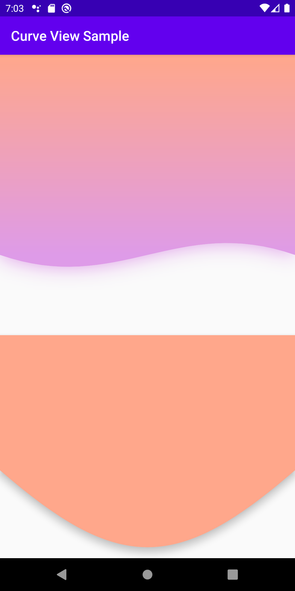

# Curve View
This view used to draw custom backgrounds that support:

1. curved shapes
2. gradient colors
3. shadows of different colors


# Example


```
<?xml version="1.0" encoding="utf-8"?>
<androidx.constraintlayout.widget.ConstraintLayout
    xmlns:android="http://schemas.android.com/apk/res/android"
    xmlns:app="http://schemas.android.com/apk/res-auto"
    android:layout_width="match_parent"
    android:layout_height="match_parent"
    android:clipChildren="false">


    <com.haytham.coder.curveview.CurveView
        android:id="@+id/curvedView"
        android:layout_width="match_parent"
        android:layout_height="0dp"
        android:layout_marginBottom="100dp"
        app:startColor="#FFA78B"
        app:startColorX="0.5"
        app:startColorY="-25"
        app:endColor="#DE9BE8"
        app:endColorX="0.5"
        app:endColorY="25"
        app:firstControlPointExtraY="1.2"
        app:firstControlPointX="0.4"
        app:secondControlPointExtraY="0.8"
        app:secondControlPointX="0.6"
        app:curveShadowColor="#DE9BE8"
        app:curveShadowRadius="24dp"
        app:layout_constraintBottom_toTopOf="@+id/curvedView2"
        app:layout_constraintEnd_toEndOf="parent"
        app:layout_constraintHorizontal_bias="0.0"
        app:layout_constraintStart_toStartOf="parent"
        app:layout_constraintTop_toTopOf="parent"
        app:layout_constraintVertical_bias="0.0"
        app:layout_constraintVertical_chainStyle="spread_inside"
        />

    <com.haytham.coder.curveview.CurveView
        android:id="@+id/curvedView2"
        android:layout_width="match_parent"
        android:layout_height="0dp"
        android:layout_marginBottom="16dp"
        android:elevation="8dp"
        app:startColor="#FFA78B"
        app:endColor="#FFA78B"
        app:firstControlPointExtraY="1.5"
        app:firstControlPointX="0.4"
        app:secondControlPointExtraY="1.5"
        app:secondControlPointX="0.6"
        app:layout_constraintBottom_toBottomOf="parent"
        app:layout_constraintEnd_toEndOf="parent"
        app:layout_constraintHorizontal_bias="0.5"
        app:layout_constraintStart_toStartOf="parent"
        app:layout_constraintTop_toBottomOf="@+id/curvedView"
        app:layout_constraintVertical_bias="0.496"
        />

</androidx.constraintlayout.widget.ConstraintLayout>
```
# Installation
1. Add maven to project-level gradle file
```
allprojects {
    repositories {
        google()
        jcenter()

        maven { url 'https://jitpack.io' }
    }
}
```
2. Add the dependency in your module-level gradle file
```
dependencies {
...
implementation 'com.github.haytham-c01:CurveView:LATEST_RELEASE
}
```
# Attributes
### Control Points
These points define the shape of the curve (look for bezier curves to know more...)
| Name                       | Description                                     | Type                   | Default Value |
| -------------------------- |------------------------------------------------ | :--------------------: | :-----------: |
| firstControlPointX         | percentage of first control point x position    |   float(range 0-1)     |  0.4f         |
| firstControlPointY         | percentage of the height of first control point in proportion to view height                                                                                                            |   float(range 0-2)     |  1.2f         |
| secondControlPointX        | percentage of second control point x position   |   float(range 0-1)     |  0.5f         |
| secondControlPointY        | percentage of the height of second control point in proportion to view height                                                                                                            |   float(range 0-2)     |  0.8f         |
#### NOTES:
1. in x percentage 0 -> LEFT of the view, AND 1 -> RIGHT of the view
2. in y percentage 0 -> TOP of the view, AND 1 -> BOTTOM of the view
#### TIPS:
1. y value can be < 1 to produce up curve, or > 1 to produce up curve
2. setting y value for both points to One will produce straight line
3. use same values for first and second control points to convert it into a single control point
### Gradient
| Name          | Description                           | Type                 | Default Value   |
| ------------- | ------------------------------------- | :------------------: | :-------------: |
| startColor    | gradient start color                  |   color              |  Cayn           |
| startColorX   | percentage of start color x position  |   float(range 0-1)   |  0.1f           |
| startColorY   | percentage of start color y position  |   float(range 0-1)   |  0.0f           |
| endColor      | gradient end color                    |   color              |  Yellow         |
| endColorX     | percentage of end color x position    |   float(range 0-1)   |  0.65f          |
| endColorY     | percentage of end color y position    |   float(range 0-1)   |  1f             |
#### NOTES:
1. in x percentage 0 -> LEFT of the view AND 100 -> RIGHT of the view
2. in y percentage 0 -> TOP of the view AND 100 -> BOTTOM of the view
3. use same color for start and end values to get solid (not gradient) background
### Shadow
| Name                | Description                         | Type            | Default Value |
| ------------------- |------------------------------------ | :-------------: | :-----------: |
| curveShadowRadius   | the shadowRadius of customShadow    |   dimention     |  0f           |
| curveShadowColor    | shadow color                        |   color         |  Black        |
#### Important Guide
There is 2 ways to set shadow
1. Using elevation, this requires
    * elevation attr > 0
    * convex shape (path.isConvex = true)
2. Using the custom attribute defined above, this requires
    * curveShadowRadius > 0
    * android:clipChildren of parent layouts = false
    
if both used, material elevation (1st point) will be favored
# License
```
Copyright 2013 Square, Inc.

Licensed under the Apache License, Version 2.0 (the "License");
you may not use this file except in compliance with the License.
You may obtain a copy of the License at

   http://www.apache.org/licenses/LICENSE-2.0

Unless required by applicable law or agreed to in writing, software
distributed under the License is distributed on an "AS IS" BASIS,
WITHOUT WARRANTIES OR CONDITIONS OF ANY KIND, either express or implied.
See the License for the specific language governing permissions and
limitations under the License.
```
